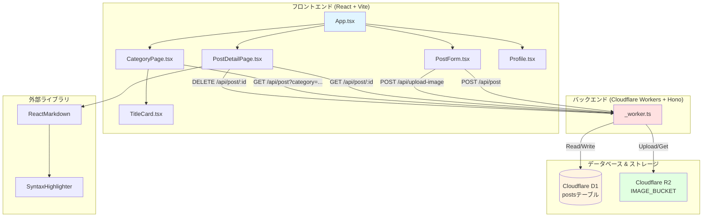
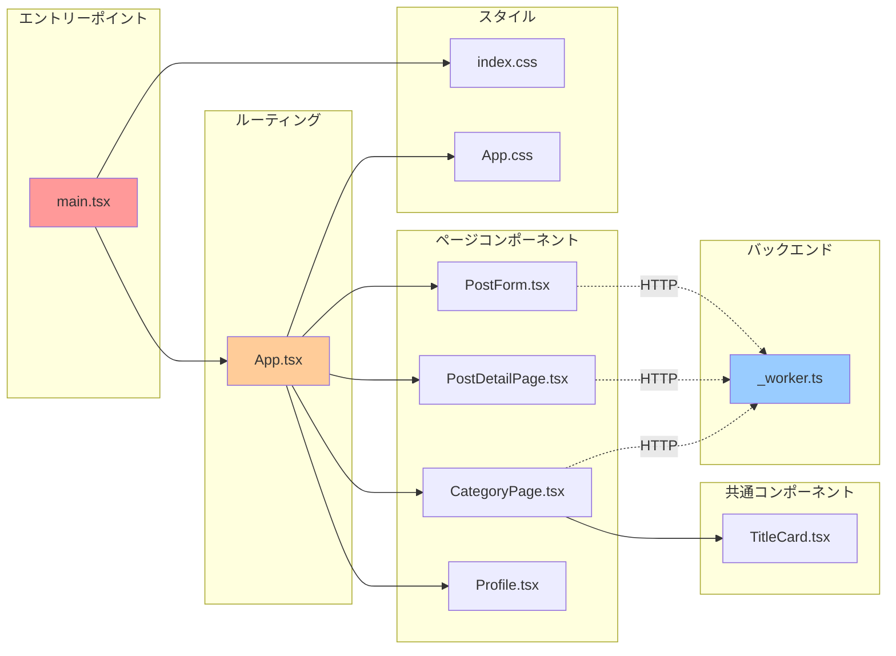
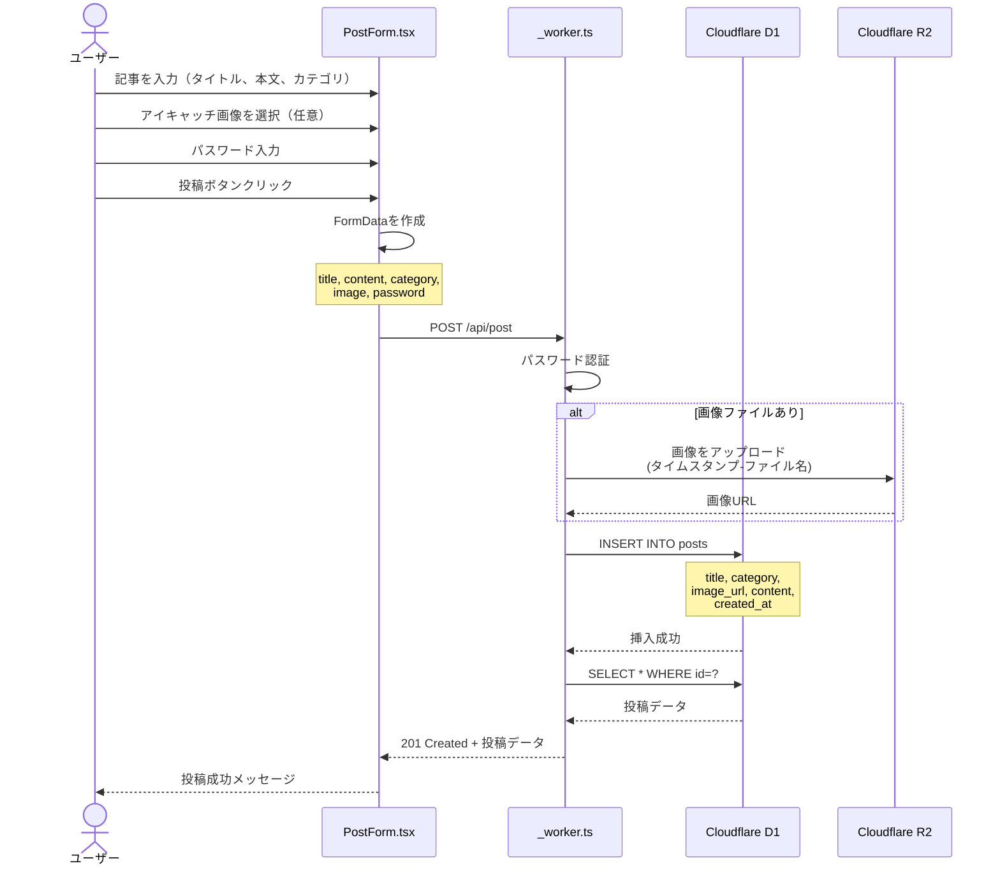
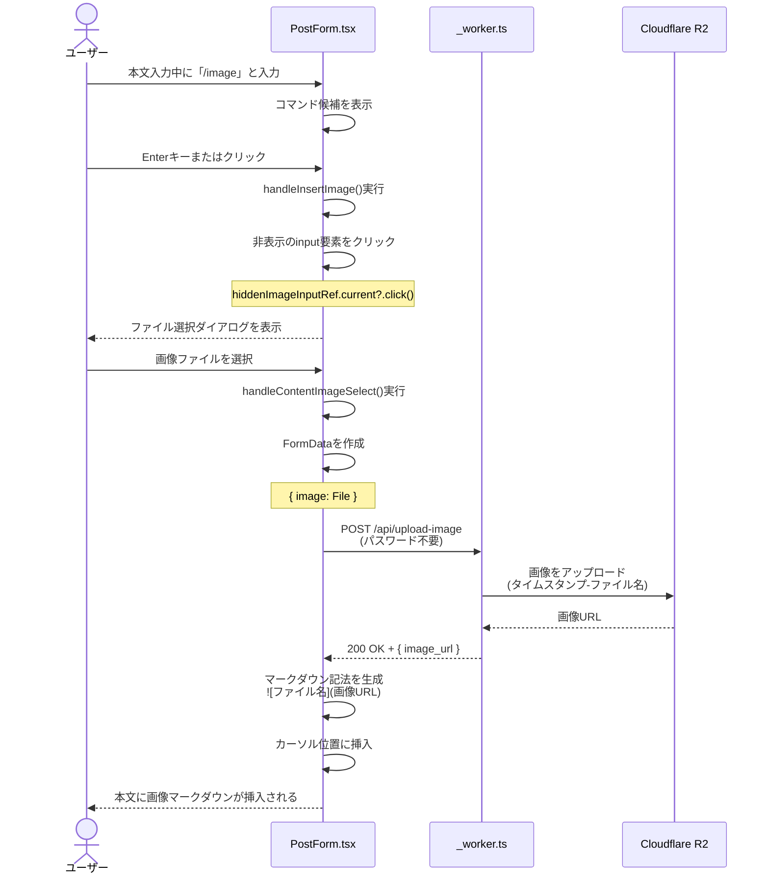
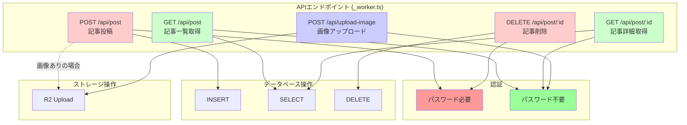
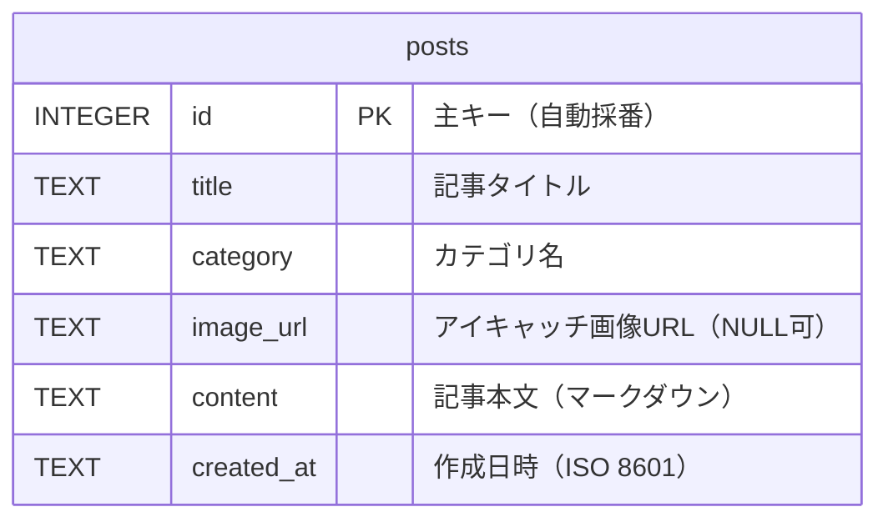
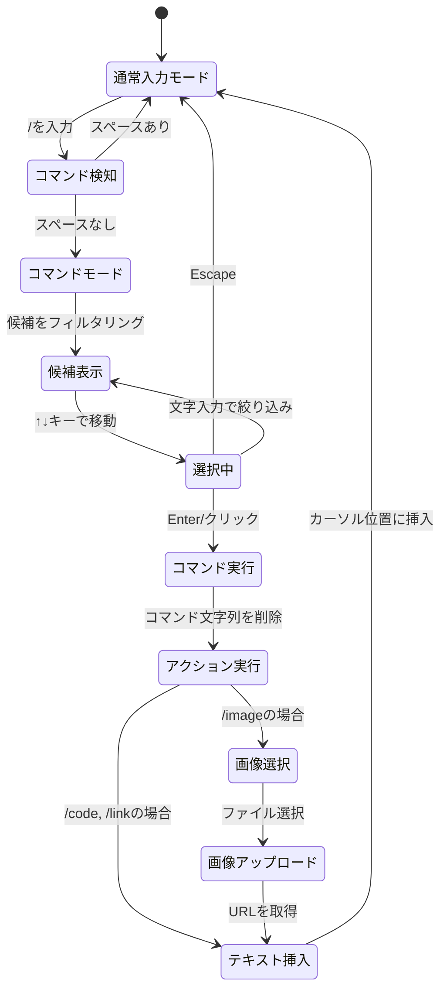
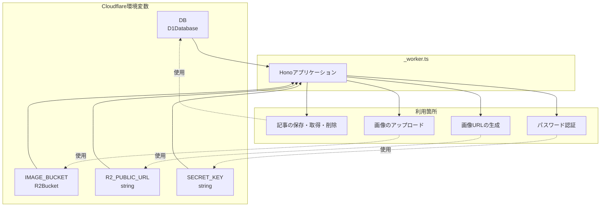
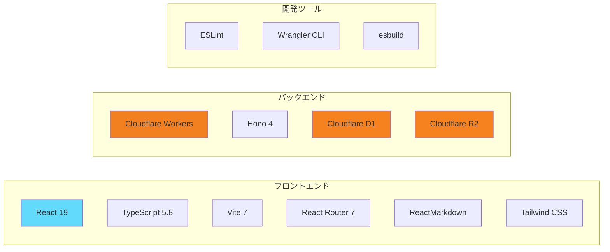
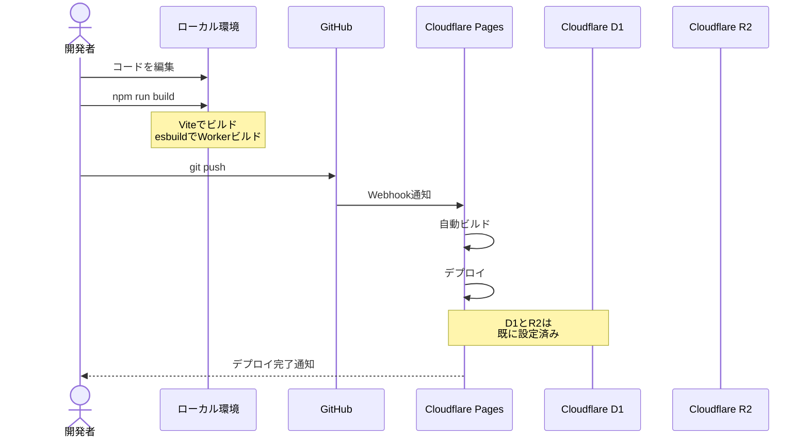

# システムアーキテクチャ

このドキュメントでは、ブログアプリケーション全体の構成とファイル間の関係を図で説明します。

---

## 目次
1. [システム全体構成](#システム全体構成)
2. [ファイル依存関係](#ファイル依存関係)
3. [データフロー - 記事投稿](#データフロー---記事投稿)
4. [データフロー - 画像アップロード](#データフロー---画像アップロード)
5. [APIエンドポイント一覧](#apiエンドポイント一覧)
6. [コンポーネント構造](#コンポーネント構造)

---

## システム全体構成



---

## ファイル依存関係



---

## データフロー - 記事投稿



---

## データフロー - 画像アップロード

### /imageコマンドによる画像挿入



---

## APIエンドポイント一覧



### エンドポイント詳細

| エンドポイント | メソッド | 認証 | 説明 | 実装ファイル |
|--------------|---------|------|------|------------|
| `/api/post` | POST | ✅ 必要 | 記事を投稿（画像も含む） | `_worker.ts:62` |
| `/api/post` | GET | ❌ 不要 | 記事一覧を取得（カテゴリ絞り込み可） | `_worker.ts:127` |
| `/api/post/:id` | GET | ❌ 不要 | 特定の記事を取得 | `_worker.ts:159` |
| `/api/post/:id` | DELETE | ✅ 必要 | 記事を削除 | `_worker.ts:185` |
| `/api/upload-image` | POST | ❌ 不要 | 画像のみをアップロード | `_worker.ts:230` |

---

## コンポーネント構造

```mermaid
graph TB
    subgraph "App.tsx - ルートコンポーネント"
        Router[BrowserRouter]
    end

    subgraph "ページ"
        Home[ホームページ<br/>CategoryPage]
        Post[記事詳細<br/>PostDetailPage]
        Form[投稿フォーム<br/>PostForm]
        Prof[プロフィール<br/>Profile]
    end

    subgraph "共通コンポーネント"
        Card[記事カード<br/>TitleCard]
        Header[ヘッダー<br/>(sticky)]
    end

    subgraph "外部ライブラリ"
        RM[ReactMarkdown]
        SH[SyntaxHighlighter]
    end

    Router --> Home
    Router --> Post
    Router --> Form
    Router --> Prof

    Home --> Card
    Router --> Header

    Post --> RM
    RM --> SH

    style Router fill:#e1f5ff
    style Home fill:#ffe1e1
    style Post fill:#ffe1e1
    style Form fill:#ffe1e1
    style Prof fill:#ffe1e1
    style Card fill:#fff4e1
    style Header fill:#fff4e1
```

---

## データベーススキーマ



### postsテーブル

| カラム名 | 型 | 制約 | 説明 |
|---------|-----|------|------|
| `id` | INTEGER | PRIMARY KEY | 自動採番される一意のID |
| `title` | TEXT | NOT NULL | 記事のタイトル（最大30文字） |
| `category` | TEXT | NOT NULL | カテゴリ（温泉、料理、ねこ、技術、日常） |
| `image_url` | TEXT | NULL | アイキャッチ画像のURL（R2） |
| `content` | TEXT | NOT NULL | 記事本文（マークダウン形式） |
| `created_at` | TEXT | NOT NULL | 作成日時（ISO 8601形式） |

---

## スラッシュコマンドの処理フロー



---

## 環境変数とバインディング



### 環境変数一覧

| 変数名 | 型 | 説明 | 使用箇所 |
|--------|-----|------|---------|
| `DB` | D1Database | Cloudflare D1データベース | 記事のCRUD操作 |
| `IMAGE_BUCKET` | R2Bucket | Cloudflare R2バケット | 画像の保存 |
| `R2_PUBLIC_URL` | string | R2の公開URL | 画像URLの生成 |
| `SECRET_KEY` | string | 管理者パスワード | 投稿・削除時の認証 |

---

## ファイル一覧とその役割

### フロントエンド

| ファイル | 役割 | 主な機能 |
|---------|------|---------|
| `src/main.tsx` | エントリーポイント | Reactアプリのマウント |
| `src/App.tsx` | ルートコンポーネント | ルーティング、ヘッダー |
| `src/components/PostForm.tsx` | 投稿フォーム | 記事投稿、スラッシュコマンド |
| `src/components/PostDetailPage.tsx` | 記事詳細ページ | マークダウン表示、削除機能 |
| `src/components/CategoryPage.tsx` | カテゴリページ | 記事一覧、カテゴリフィルタ |
| `src/components/Profile.tsx` | プロフィールページ | 自己紹介表示 |
| `src/category/title_card.tsx` | 記事カード | 記事カードコンポーネント |
| `src/index.css` | グローバルCSS | 全体のスタイル定義 |
| `src/App.css` | App用CSS | Appコンポーネントのスタイル |

### バックエンド

| ファイル | 役割 | 主な機能 |
|---------|------|---------|
| `_worker.ts` | Cloudflare Workers | 全APIエンドポイント |
| `functions/api/post.ts` | （未使用） | 古いアーキテクチャの残骸 |

### 設定ファイル

| ファイル | 役割 |
|---------|------|
| `package.json` | 依存パッケージ管理 |
| `tsconfig.json` | TypeScript設定 |
| `vite.config.ts` | Vite設定 |
| `wrangler.toml` | Cloudflare Workers設定 |

---

## 技術スタック



---

## デプロイメントフロー



---

**最終更新**: 2026-01-19
